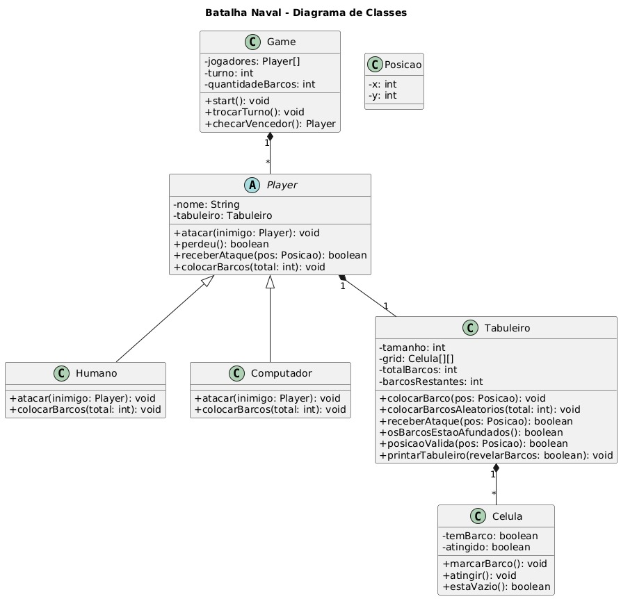

# 🚢 Batalha Naval em Java

## 📌 Descrição
Este projeto implementa o clássico jogo **Batalha Naval** em **Java**, utilizando os princípios da **Programação Orientada a Objetos (POO)**.  
O objetivo é aplicar conceitos como **herança, polimorfismo, encapsulamento e abstração**, além de explorar boas práticas de modelagem com **diagrama de classes UML**.

## 👥 Integrantes
- Erick Antunes Raposo
- Filipe Freitas Campos
- Pedro da Costa Aguiar

## 🎮 Funcionalidades
- Tabuleiro dinâmico com posicionamento de navios.
- Dois modos de jogo: Jogador vs jogador e jogador vs máquina.
- Sistema de turnos com ataques alternados.
- Indicação de acertos, erros e navios afundados.
- Finalização automática ao detectar o vencedor.

## 🛠️ Estrutura do Projeto

O projeto foi modelado a partir do seguinte **diagrama de classes UML**:



### 📂 Principais Classes
- **Game** → Controla o fluxo do jogo, turnos e verificação do vencedor.
- **Player (abstrata)** → Define atributos e comportamentos básicos dos jogadores.
    - **Humano** → Permite que o jogador escolha onde atacar e posicionar navios.
    - **Computador** → Gera ataques e posicionamentos de forma automática.
- **Tabuleiro** → Representa a grade de células, valida posições e gerencia os navios.
- **Celula** → Define o estado de cada posição (se possui barco, se foi atingida).
- **Posicao** → Representa coordenadas no tabuleiro (x, y).

## 📚 Conceitos de POO Utilizados
- **Abstração** → Classe `Player` representa a ideia de um jogador, sem definir a implementação.
- **Herança** → `Humano` e `Computador` herdam de `Player`.
- **Polimorfismo** → Cada tipo de jogador implementa o ataque de forma distinta.
- **Encapsulamento** → Atributos como `grid` do `Tabuleiro` são manipulados apenas por métodos específicos.

## ▶️ Como Executar
1. Certifique-se de ter o **Java (17 ou superior)** instalado:
    ```bash
    java -version
    ```
2. Compile o projeto:
    ```bash
    javac Main.java
    ```
3. Execute o jogo:
    ```bash
    java Main
    ```